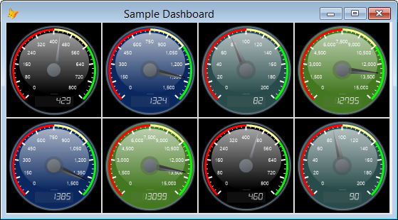

# Gauge

Project Manager: [Doug Hennig](mailto:dhennig@stonefield.com)

## Introduction

People like visual images. Most people would rather see a chart than columns of raw numbers because it’s easier to see the relationships between items visually. Adding analysis tools like charts and gauges to your applications make them much more valuable to your users.  

What is a gauge? A gauge is an image that shows how a single value compares to a maximum or goal value. The two values can be anything: current sales compared to budget, volume to date compared to the maximum allowable volume, and so on. For example, many charitable organizations show the current status of their fund raising campaigns as a thermometer. The top of the thermometer represents the value of the fund raising goal and the height of the bar inside the thermometer represents how much money has been raised so far.  

The most common type of gauge looks like a speedometer in a car; for example:  

The end of the gauge represents the maximum value and the position of the needle represents the current value. Color bands around the outside edge of the gauge show the ranges of certain categories. For example, in the figure above, the red band indicates where sales are too low, the yellow band where they’re acceptable but not great, and the green band where sales should be to make the boss happy.

## The Gauge class

There’s just a single class used to draw gauges: Gauge in Gauge.VCX (additional components are also required as I’ll discuss later). It’s a subclass of Custom so it has no visible appearance at runtime. How does the gauge appear then? After you call the DrawGauge method, the cImage property is set to the bytes for the gauge image. You can use FILETOSTR() to write the contents of cImage to a file, such as if you want to use the gauge in a report, or set the PictureVal property of an Image object if you want it to appear in a form. For example, SampleGauge.SCX, one of the forms included in the downloads, uses this code to have the Gauge object referenced in the oGauge property draw a gauge in an Image named imgGauge:  

<pre>with This
    .oGauge.nSize = .imgGauge.Width
    .oGauge.DrawGauge()
    .imgGauge.PictureVal = .oGauge.cImage
endwith
</pre>

Here are the properties of the Gauge class.  

<table>

<tbody>

<tr>

<th>Property</th>

<th>Description</th>

</tr>

<tr>

<td>cDialText</td>

<td>The text for the dial</td>

</tr>

<tr>

<td>cDialTextFontName</td>

<td>The font for the dial text</td>

</tr>

<tr>

<td>cErrorMessage</td>

<td>The text of any error that occurs</td>

</tr>

<tr>

<td>cFormat</td>

<td>The format for the labels in .NET syntax: {0:#,##0} by default</td>

</tr>

<tr>

<td>cImage</td>

<td>The gauge image</td>

</tr>

<tr>

<td>cLabelFontName</td>

<td>The font for the labels</td>

</tr>

<tr>

<td>lAdjustLabelSize</td>

<td>.T. to adjust the label size based on the gauge size, .F. to use the size specified in nLabelFontSize</td>

</tr>

<tr>

<td>lDialTextFontBold</td>

<td>.T. if the dial text is bold</td>

</tr>

<tr>

<td>lDialTextFontItalic</td>

<td>.T. if the dial text is italics</td>

</tr>

<tr>

<td>lDisplayDigitalValue</td>

<td>.T. to display the value in a digital display</td>

</tr>

<tr>

<td>lLabelFontBold</td>

<td>.T. if the label text is bold</td>

</tr>

<tr>

<td>lLabelFontItalic</td>

<td>.T. if the label text is italics</td>

</tr>

<tr>

<td>lShowGoalMarker</td>

<td>.T. to display a marker for the goal value</td>

</tr>

<tr>

<td>lValuesAsPercentages</td>

<td>.T. to use percentages for values, .F. to use amounts for values</td>

</tr>

<tr>

<td>nBackColor</td>

<td>The background color or the starting color for a background gradient</td>

</tr>

<tr>

<td>nBackColor2</td>

<td>The end color for a background gradient; if it's the same as nBackColor, there is no gradient</td>

</tr>

<tr>

<td>nBackColorAlpha</td>

<td>The alpha for the background color</td>

</tr>

<tr>

<td>nBackGradientMode</td>

<td>The mode for a background gradient: 0 = left to right, 1 = top to bottom, 2 = from top left, 3 = from top right</td>

</tr>

<tr>

<td>nBand1Color</td>

<td>The color for band 1</td>

</tr>

<tr>

<td>nBand1End</td>

<td>The ending position for band 1</td>

</tr>

<tr>

<td>nBand2Color</td>

<td>The color for band 2</td>

</tr>

<tr>

<td>nBand2End</td>

<td>The ending position for band 2</td>

</tr>

<tr>

<td>nBand3Color</td>

<td>The color for band 3</td>

</tr>

<tr>

<td>nDialAlpha</td>

<td>The alpha for the dial color</td>

</tr>

<tr>

<td>nDialColor</td>

<td>The color to use for the dial</td>

</tr>

<tr>

<td>nDialTextColor</td>

<td>The color for the dial text</td>

</tr>

<tr>

<td>nDialTextFontSize</td>

<td>The font size for the dial text</td>

</tr>

<tr>

<td>nDigitsColor</td>

<td>The color for digital digits</td>

</tr>

<tr>

<td>nGlossiness</td>

<td>The glossiness value (0 – 100)</td>

</tr>

<tr>

<td>nGoalMarkerColor</td>

<td>The color to use for the goal marker</td>

</tr>

<tr>

<td>nGoalPosition</td>

<td>The goal value for the gauge</td>

</tr>

<tr>

<td>nLabelColor</td>

<td>The color to use for labels</td>

</tr>

<tr>

<td>nLabelDistance</td>

<td>The distance between labels and major tick marks</td>

</tr>

<tr>

<td>nLabelFactor</td>

<td>The factor to use for labels: 1, 1000, 10000, etc.</td>

</tr>

<tr>

<td>nLabelFontSize</td>

<td>The font size for the labels</td>

</tr>

<tr>

<td>nMajorTickColor</td>

<td>The color of major tick marks</td>

</tr>

<tr>

<td>nMajorTickCount</td>

<td>The number of major ticks</td>

</tr>

<tr>

<td>nMaxValue</td>

<td>The maximum value for the gauge</td>

</tr>

<tr>

<td>nMinorTickColor</td>

<td>The color of minor tick marks</td>

</tr>

<tr>

<td>nMinorTickCount</td>

<td>The number of minor ticks</td>

</tr>

<tr>

<td>nMinValue</td>

<td>The minimum value for the gauge</td>

</tr>

<tr>

<td>nSize</td>

<td>The height and width of the gauge (it's a square so they're the same)</td>

</tr>

<tr>

<td>nValue</td>

<td>The current value for the gauge</td>

</tr>

<tr>

<td>oBridge</td>

<td>A reference to a wwDotNetBridge object</td>

</tr>

<tr>

<td>oGauge</td>

<td>A reference to a .NET GaugeControl object</td>

</tr>

</tbody>

</table>

As you can see, there are quite a few of them. Most of them affect the appearance of the gauge. The best way to check out how the various properties work is by running SampleGauge.SCX:  

  

Each control has a tooltip specifying which property it controls. Changing any setting immediately redraws the gauge so you can instantly see the effect.  

Here are comments about some of the properties:

*   nGlossiness controls how bright the “glossy” ellipse that appears at the top of the gauge is. This ellipse gives the illusion of reflected light, as if the gauge was made of glass or plastic.

*   The gauge size is determined by the nSize property; since a gauge is drawn as a square, the height and width of the image are both set to nSize.

*   By default, the labels indicating the values around the gauge are sized based on the size of the gauge: the larger the gauge, the bigger the labels. Set lAdjustLabelSize to .F. if you want to use the font size specified in nLabelFontSize instead.

*   cFormat indicates how the labels are formatted. It has to use .NET syntax for number formats for reasons that will be obvious later. .NET syntax uses “#” as an optional digit placeholder, “0” as a digit placeholder that displays 0 if there is no digit, “.” for a decimal separator, and “,” to use a thousands separator (unlike VFP, only one is needed in the format even when numbers exceed one million). The format string is surrounded with “{0:” and “}”, so the default of “{0:#,##0}” specifies no leading zeros, no decimal places, and thousands separators.

*   nBand1End indicates where on the outer rim of the gauge the first color band appears, such as the red band in Figure 1\. Only the end value is needed, since the band starts at 0\. Similarly, nBand2End and nBand3End indicate the ending positions of the second and third color bands, with the starting positions being the end of the previous band.

*   By default, nBand1End, nBand2End, and nBand3End are assumed to be percentages, so a value of 35 indicates an ending position of 35% of the gauge arc. If you want to use amounts instead, such as 25,000, set lValuesAsPercentages to .F.

*   Since the gauge can’t go above the 100% or below 0%, the needle is pegged at those values when nValue is greater than nMaxValue or less than nMinValue. Because you may want the maximum value to be a goal that could be exceeded (for example, a salesperson’s monthly quota may be $10,000 but they certainly could sell more than that), you can set nGoalPosition to a lower value than 100\. For example, if you set it to 75, then the nMaxValue value appears at 75%.

*   nMinValue can be larger than nMaxValue; for example, you may want a gauge than runs from 100 to 0.

*   For larger numbers (over 1,000), the labels can overlap the major tick marks, so increase the value of nLabelDistance accordingly. Alternatively, you can set nLabelFactor to a value to divide the labels by so smaller numbers are shown. For example, if you set nLabelFactor to 10000, the 5,000 position on the gauge appears as “5.”

## Creating a dashboard

Dashboards are all the rage these days. A dashboard is a form displaying multiple panels of information, such as charts, reports, and of course gauges. Another sample form that comes with the downloads, Dashboard.SCX, is a simple demo of how a dashboard might work.  

  

This form is actually quite simple. Its Init method adds eight Image controls and sizes and positions them so they take up two rows of four images. A Timer on the form calls the form’s DrawGauges method, which uses a single Gauge control to do the drawing. DrawGauges sets the properties of the Gauge control to different values for each gauge (different dial colors and different current and maximum values), draws the gauge, and sets the PictureVal property of each Image control to the resulting image. Just for fun, the timer fires every 2 seconds and shows a random value so you can see the needles move.

## How Gauge works

The Gauge class is actually a wrapper for a .NET DLL that does all the work. I’ll discuss the .NET class later.  
To avoid COM registration and other issues, I use Rick Strahl’s wwDotNetBridge utility ([https://west-wind.com/wwDotnetBridge.aspx](https://west-wind.com/wwDotnetBridge.aspx)). As you can see in the code below, the Init method of Gauge instantiates wwDotNetBridge into the oBridge property. Since you usually only want a single instance of wwDotNetBridge in an application, you can pass an existing instance to Init instead. Init also loads the Gauge.DLL .NET assembly and instantiates the Gauge.GaugeControl class into the oGauge property.  

Since the .NET DLL does all the work, all the DrawGauge method of the Gauge class has to do is populate the properties of the .NET object with the values of its own properties, call the .NET object’s DrawGauge method, and put the return value, which is the bytes of the gauge image, into cImage.  

The only complication in DrawGauge is that VFP color values don’t match up with .NET color values: the .NET values have the red, green, and blue components reversed, and also support an alpha, or transparency, value. So, DrawGauge calls a helper method named GetColor, which pulls out the color components and puts them into the order needed for .NET.

## The .NET component

GaugeControl.cs, included with the downloads, is the source code for the .NET gauge component in Gauge.DLL. I started with code created by Ambalavanar Thirugnanam, available from [http://www.ucancode.net/Visual_C_MFC_Samples/CSharp_Example_Free_DOTNET_Gauge_Control_Draw_Source_Code.htm](http://www.ucancode.net/Visual_C_MFC_Samples/CSharp_Example_Free_DOTNET_Gauge_Control_Draw_Source_Code.htm), and made a number of changes to it:

*   I modified it to be a simple .NET class that returns an image as a string rather than a Windows Forms User Control that displays the gauge. This allows the image to be written to a file or displayed in a VFP Image control without having to worry about registering the .NET control as an ActiveX control and adding it to a VFP form.

*   I added properties for various colors, such as the background color, rather than using hard-coded values.

*   I added support for a background gradient in addition to a solid color.

*   Because it’s difficult to create a .NET Font object in VFP, even with wwDotNetBridge, I added properties for the name, size, bold, and italics settings of fonts used for the dial text and labels. GaugeControl uses these properties to instantiate a Font object with the specified settings.

If you’re interested in how the .NET component works, I recommend reading the article mentioned above as it discusses the logic and math involved in drawing the gauge. Then examine the C# source code in GaugeControl.cs to see how it’s implemented.  

If you build the Gauge solution that includes GaugeControl.cs, you’ll find that it has a post-build event that copies the DLL to the parent folder of the solution, which is the same folder as Gauge.VCX is located. Note that if you’ve used the VFP Gauge control and VFP is still open, you have to close VFP before building the .NET solution because the .NET DLL is still open in VFP.  

Since GaugeControl.cs uses GDI+ to do all of the drawing, why didn’t I convert the C# code to VFP code using the VFPX GDIPlusX project? After all, that would give us a 100% VFP solution with no need for wwDotNetBridge or Gauge.DLL. The reason I didn’t is two-fold:

*   Why reinvent the wheel? It would’ve taken several hours to convert the C# code into the equivalent VFP code and there’d be lots of debugging to make sure it works the same.

*   I’ve run into some performance issues with GDIPlusX on some machines. In fact, this is what prompted me to look at this solution in the first place. I was using the VFPX FoxCharts project to draw gauges but found that on some systems, it was taking a minute or more to draw the gauge. In tracking the problem down, I found that on those systems, some of the GDI+ function calls were taking an order of magnitude longer to execute, and these functions were called thousands of times for each gauge. I don’t know why some systems have this performance problem with GDIPlusX but the .NET component has no such problems on those systems.

## Deploying Gauge

Deploying Gauge is straightforward:

*   Add Gauge.VCX and wwDotNetBridge.PRG to your project.

*   Use the Gauge class as you see fit: to create image files for reports (cImage is in PNG format) or for the source of images in forms.

*   Include wwDotNetBridge.DLL, ClrHost.DLL, and Gauge.DLL in your installer or copy those files to the client’s system. No registration is required for any of these components.

Gauge.DLL requires version 2.0 of the .NET framework. Windows Vista and later come with .NET 2.0 so this is only an issue for Windows XP and earlier. If you use Inno Setup as your application installer, you can make your installer detect whether .NET 2.0 is missing and automatically download and install it by adding #INCLUDE DotNet2Install.iss to your Inno script file. DotNet2Install.iss is included in the downloads, as is Isxdl.DLL, a component used by DotNet2Install.iss.